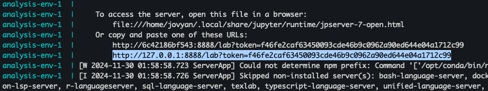

# Car Evaluation Analysis

Authors: Danish Karlin Isa, Nicholas Varabioff, Ximin Xu, Zuer Zhong

This project is part of the coursework for DSCI 522 Data Science Workflows, a course of the Master of Data Science program at the University of British Columbia.

## About

This project attempts to predict the level of acceptability of cars using machine learning methods.
Using a 1997 dataset, the influence of various attributes of a new car on its acceptability among customers is analysed.
These attributes include:

* The buying price of the car
* Maintenance costs
* Number of doors
* Passenger capacity
* Boot size
* Safety ratings

This analysis aims to identify the key factors that determine whether a car is considered acceptable, good, or unacceptable according to standardized criteria. To achieve this, several common machine learning models were explored. The SVM RBF classifier was identified as the best-performing model, achieving a test accuracy of 0.952. On the 346 test data cases, it correctly predicted the targets of 343 examples, with only 3 misclassifications. The SVM RBF model demonstrated exceptional performance, as shown by its confusion matrix, classification reports, and high precision, recall, and F1 scores. However, a slight decrease in classification precision was observed for the “good” category, alongside a relatively lower recall score of 0.86, indicating occasional classification errors.Nonetheless, the results obtained from this analysis further exemplifies the ability of the SVM RBF model in handling nonlinear decision boundaries. This makes the SVM RBF model a solid choice for this project. 

The dataset used in this project is the Car Evaluation Database created by M. Bohanec and V. Rajkovic in the early 1990s. 
It was sourced from the UCI Machine Learning Repository and is publicly available for research and can be found in the [UCI Machine Learning Repository](https://archive.ics.uci.edu/dataset/19/car+evaluation).

## Report

The final report can be found [here](https://github.com/UBC-MDS/Car_Evaluation_Analysis/blob/main/notebooks/car_evaluation_analysis.pdf).

## Project Dependencies

* Docker

## Usage

### Setup

1. If you are using Windows or Mac, make sure Docker Desktop is running.

2. Clone this GitHub repository.

### Running the Analysis

1. Navigate to the root of this repository.

2. Run the following command-line command:

    ```bash
    docker compose up
    ```

3. In the terminal, look for a URL that starts with `http://127.0.0.1:8888/lab?token=` as shown in the image below. Copy and paste that URL into your browser. This will launch Jupyter Lab.

    

4. In the Jupyter Lab window, navigate to `notebooks/Car_Evaluation_Analysis.ipynb`.

5. Under the "Kernel" menu, click "Restart Kernel and Run All Cells."

### Clean Up

1. To shut down the container and clean up the resources, type `Ctrl` + `C` in the terminal where you launched the container. Then, type `docker compose rm`.

## Developer Notes

### Developer Dependencies

* `conda` (version 23.9.0 or higher)
* `conda-lock` (version 2.5.7 or higher)
* Python and packages listed in `environment.yml`

### Adding a New Dependency

1. Create a new branch.

2. Add dependency to the `environment.yaml` file. Make sure to pin the desired package version.

3. Update the `conda-linux-64.yml` by running the following command-line command from the root of the project:

    ```bash
    conda-lock -k explicit --file environment.yml -p linux-64
    ```

4. Rebuild the Docker image locally to ensure it builds and runs properly.

5. Push the changes to GitHub. A new Docker image will be built and pushed to DockerHub automatically. It will be tagged with the SHA for the commit that changed the file.

6. Update the `docker-compose.yaml` file on your branch to use the new container image (make sure to update the tag specifically).

7. Send a Pull Request and merge your branch changes into the `main` branch.

## License

This dataset is licensed under a [Creative Commons Attribution 4.0 International (CC BY 4.0)](https://creativecommons.org/licenses/by/4.0/legalcode) license. This allows for the sharing and adaptation of the datasets for any purpose, provided that the appropriate credit is given.The software code contained within this repository is licensed under the MIT license. See the [license file](https://github.com/UBC-MDS/Car_Evaluation_Analysis/blob/main/LICENSE)for more information.

## References

* Bohanec, M. (1988). Car Evaluation [Dataset]. _UCI Machine Learning Repository._ (https://doi.org/10.24432/C5JP48).
* Makki, S., Mustapha, A., Kassim, J. M., Gharayebeh, E. H., & Alhazmi, M. (2011, April). Employing neural network and naive Bayesian classifier in mining data for car evaluation. In Proc. _ICGST AIML-11 Conference (pp. 113-119)._
* Potdar, K., Pardawala, T. S., & Pai, C. D. (2017). A comparative study of categorical variable encoding techniques for neural network classifiers. _International journal of computer applications, 175(4), 7-9._
* Tanveer, M., Gautam, C., & Suganthan, P. N. (2019). Comprehensive evaluation of twin SVM based classifiers on UCI datasets. _Applied Soft Computing, 83_, 105617.
